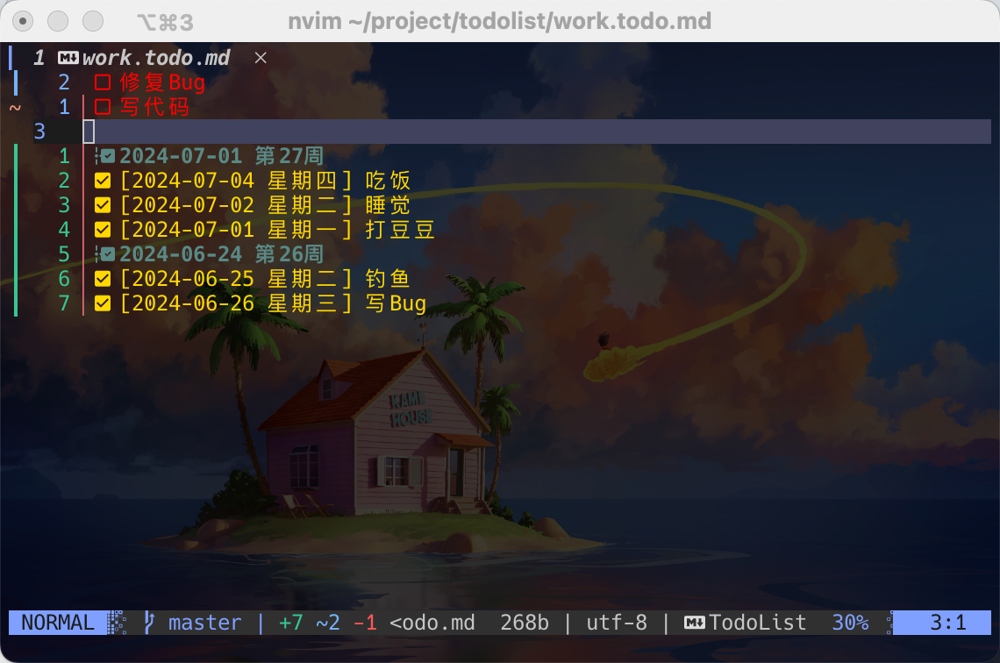

> 简单实用的ToDoList插件。适用于Nvim


# 安装
- lazy.nvim
```
{
    "94kai/todolist.nvim",
    config = function()
      -- 推荐配置该autocmd。编辑完TODO直接q退出
      vim.cmd("autocmd FileType TodoList nnoremap <buffer> q :wqa<CR>")
      require("todolist").setup()
    end,
},
```
- other
	- ...
# 使用
- nvim打开后缀为todo.md的文件即可
- o/O在光标上/下创建ToDoList
- ;完成，并自动将Done的item归类到本周Title下
# 最佳实践
- 配置altas，这样需要记录TODO时，直接终端输入todo回车即可进入
```
alias todo="nvim ~/project/todolist/work.todo.md"
```
- 配置autocmd。这样修改完TODO，直接按q离开（潇洒~~~ 哈哈）
```
vim.cmd("autocmd FileType TodoList nnoremap <buffer> q :wqa<CR>")
```
# 感谢
https://github.com/aserebryakov/vim-todo-lists
